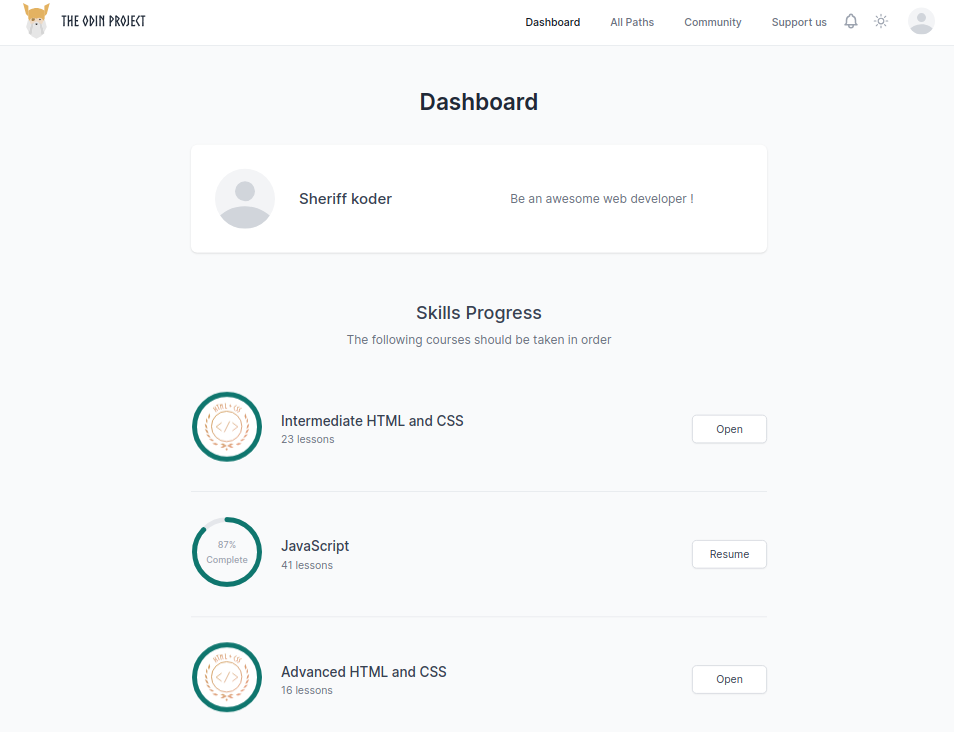
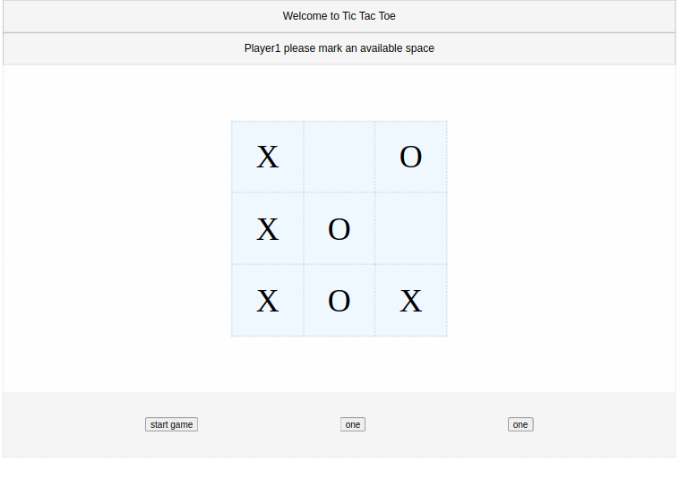

## **Course: The Odin Project (TOP) Notes**

This repo contains my notes taken from The Odin Project course.
The course does cover many subjects in Web-Development in small details. With many external theoretical and practical references to read from on the subjects being discussed.
along side with many milestone projects to complete with little guidance after each step.
###
>### **Purpose**
- Learn Web-development
###
>### **Progress**

###
>### **Topics Discussed**
- HTML
- CSS
- Forms
- Javascript
- Git
- Javascript testing
- Advanced HTML/CSS
- Accessibility
- Responsive Design
- ReactJS
- NodeJS
###
>### **Projects Examples**
*tic-tac-toe game*

###
*scientific-Calculator*

